# Решение кейсов 1-2 (Лаб. 4 DevOps Advanced)

## Артефакты
- `Dockerfile`
- `.gitlab-ci.yml`
- `CHANGELOG.md` - пример

## Кейс 1

Сначала был развернуты 3 виртуальные машины: gitlab, build и nexus. Для развертывания использовался Google Cloud, ОС: Debian 13.

Все машины находятся в одной локальной сети с адресами из пула `10.166.0.0/24`:
- Gitlab - 10.166.0.3
- Build VM - 10.166.0.4
- Nexus - 10.166.0.5

Изначально каждая машина имела внешний IP и доступ в Интернет. Был развернут Gitlab, Nexus.

## Gitlab

В Gitlab был добавлен проект (REST API на Golang с multistage сборкой)

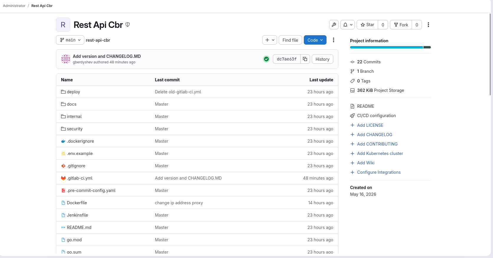

На build VM был зарегистрирован Project runner:

```
[[runners]]
  name = "build-project"
  url = "http://10.166.0.3"
  id = 4
  token = "..."
  token_obtained_at = 2026-05-16T22:26:43Z
  token_expires_at = 0001-01-01T00:00:00Z
  executor = "shell"
  clone_url = "http://10.166.0.3"
  [runners.cache]
    MaxUploadedArchiveSize = 0
    [runners.cache.s3]
      AssumeRoleMaxConcurrency = 0
    [runners.cache.gcs]
    [runners.cache.azure]
```

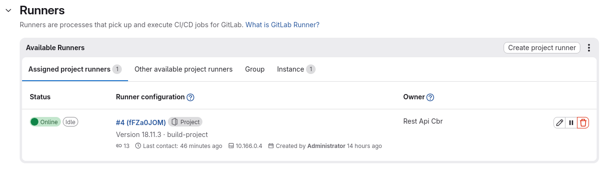


Далее был написан пайплайн с основными стейджами: proxy_login (для логина на зеркале для proxy репозитория), build, login (логин на зеркале для hosted репозитория), push (пуш образа в hosted репозиторий).

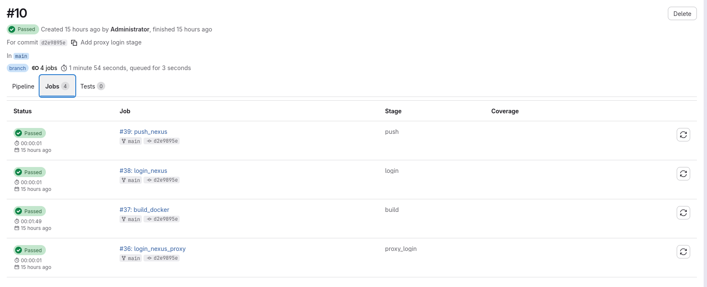

## Nexus

В Nexus был определен Docker hosted репозиторий (название - docker-selfhosted). После загрузки образа там отображаются сведения о манифестах и тегах образа.

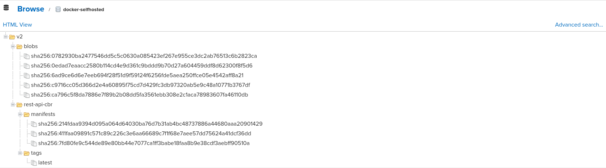

Аналогично были определены docker-proxy и golang-proxy (поддерживает анонимный доступ) репозитории.

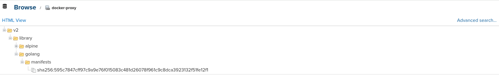

Прокси репозиторий для Docker был указан в конфиге `daemon.json`:

```
{
  "insecure-registries" : ["10.166.0.5:8082", "10.166.0.5:8083"],
  "registry-mirrors": ["http://10.166.0.5:8083"]
}
```

Раздел `insecure-registries` добавлен, т.к. SSL сертификат для репозиториев не выпускался.

Прокси репозиторий для GOLANG указан через переменную окружению в Dockerfile.

После перезапуска демона на Build VM был отключен External IP и она потеряла доступ в интернет. Раннер при этом остался доступен (обращается по внутреннему IP).

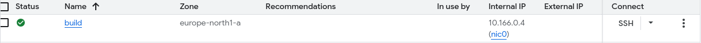

Запустим пайплайн, он успешно прошел все стадии и обновил образ в docker-selfhosted.

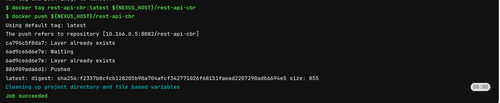

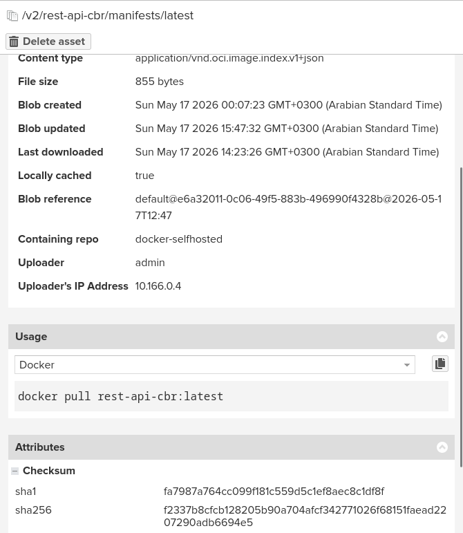


## Кейс 2 - Очистка

Для очистки образа на Build VM был создан schedule pipeline и добавлен стейдж `cleanup`, который запускается только при наличии соответствующего флага (переменной окружения).

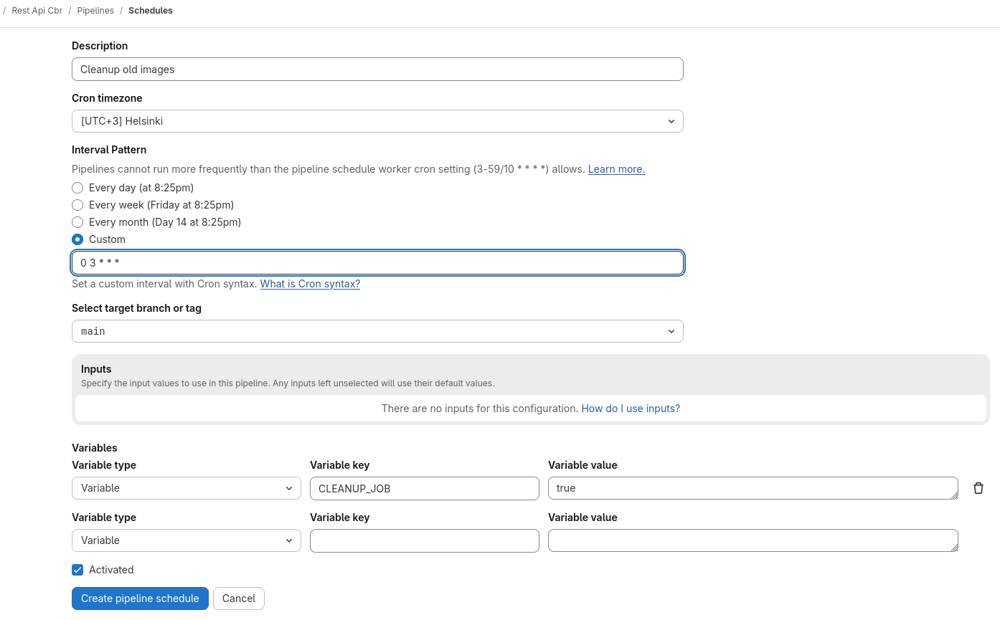

Job успешно отрабатывает при ручном запуске пайплайна. 

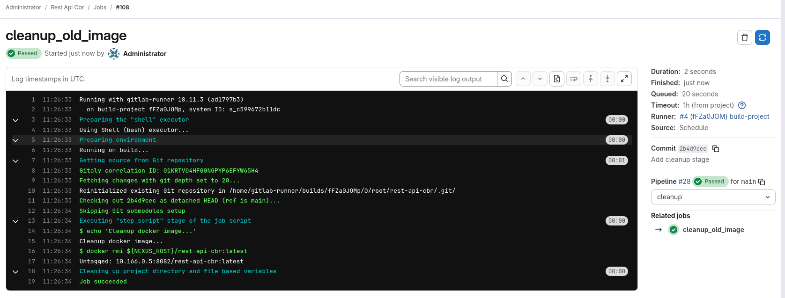

Для очистки образов в Nexus была создана Cleanup policy и Task.

Cleanup policy будет очищать образы, которые были запушены день назад и ранее.

Task будет очищать неиспользуемые манифесты и образы, которые были загружены более 12 часов назад.

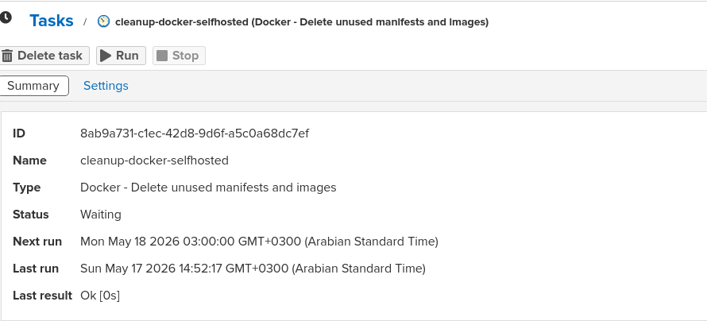

Внесем изменения в задачу, чтобы она выполняла удаление неиспользуемых манифестов, которые были загружены более 1 часа назад.

До:

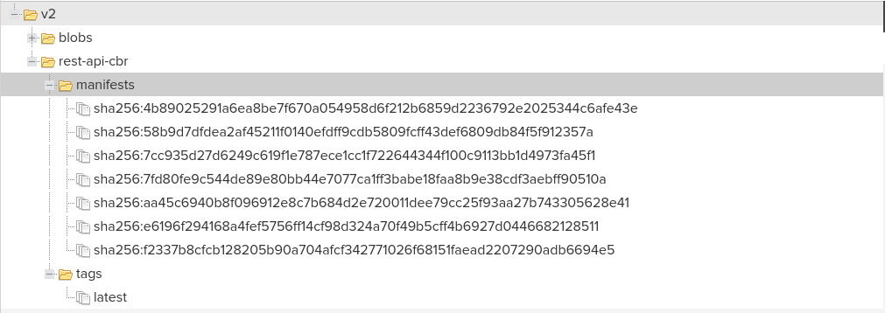


После:

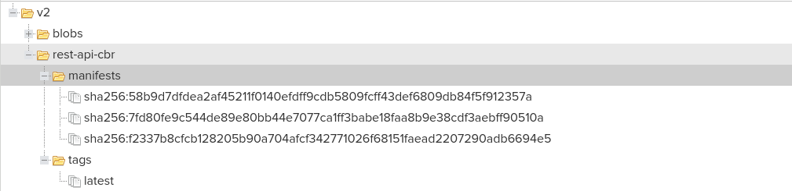

Как видно, задача по очистке успешно отработала.


## Версионирование и CHANGELOG

Версионирование было реализовано примитивно - за версию принимается дата запуска пайплайна и его ID (порядковый номер). `CHANGELOG.md` сохраняется в артефакты сборки.

В `CHANGELOG.md` перечислены последние 5 коммитов (с сообщениями) в репозитории.

## Результат

- Сборка образа приложения происходит при отсутствии доступа в Интернет на Build VM
- Раз в сутки по расписанию Gitlab выполняет удаление образа локально
- Раз в сутки в Nexus выполняется задача по удалению неиспользуемых блобов и манифестов из репозитория
- Создана clean policy в Nexus для удаления неактуальных образов
- В пайплайн добавлена стадия формирования CHANGELOG и его сохранения в артефакты сборки