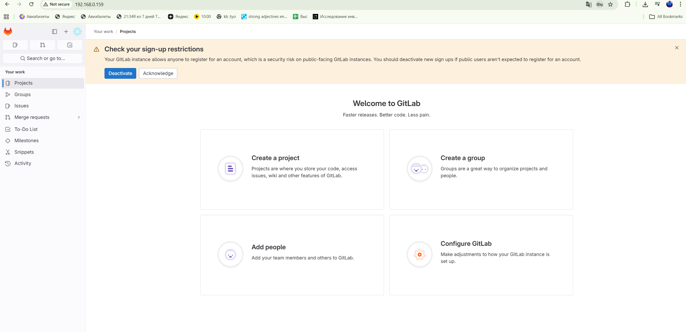
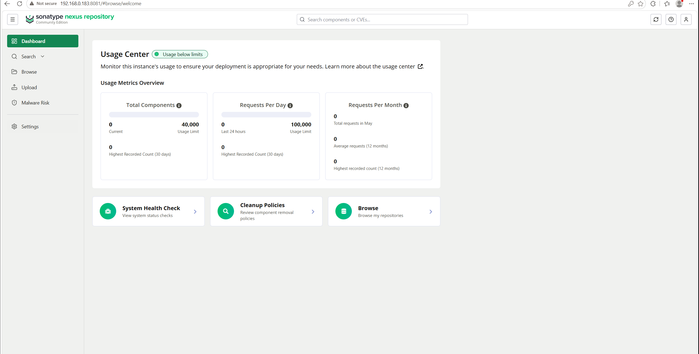
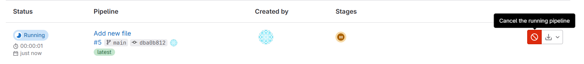
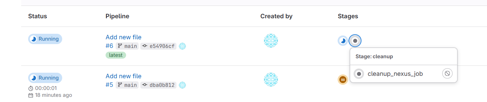
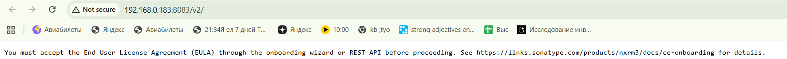

# Лабораторная работа №4 - Build and clean cases

## 1. Создаем три VM-ки

Качаем образ [ubuntu-22.04.5-live-server-amd64.iso](https://www.google.com/url?sa=E&q=https%3A%2F%2Freleases.ubuntu.com%2F22.04%2Fubuntu-22.04.5-live-server-amd64.iso)

VM gitlab:

- 2 cpu;

- 4096 MB base memory;

- 20 GB disk size.

- В качестве адаптера сети выставляем сетевой мост (интернет-кабель)

- ip: 192.168.0.159

VM nexus:

- 1 cpu;

- 4096 MB base memory;

- 15 GB disk size.

- В качестве адаптера сети выставляем сетевой мост (интернет-кабель)

- ip: 192.168.0.183

VM build:

- 1 cpu;

- 2048 MB base memory;

- 15 GB disk size.

- В качестве адаптера сети выставляем сетевой мост (интернет-кабель)

- ip: 192.168.0.180

## 2. Ставим GitLab

Подключаемся к VM для gitlab по ssh

```bash
ssh mapar221@192.168.0.159
```

```bash
Welcome to Ubuntu 22.04.5 LTS (GNU/Linux 5.15.0-177-generic x86_64)

 * Documentation:  https://help.ubuntu.com
 * Management:     https://landscape.canonical.com
 * Support:        https://ubuntu.com/pro

 System information as of Tue May 12 06:07:53 PM UTC 2026

  System load:  0.0                Processes:               110
  Usage of /:   35.9% of 19.91GB   Users logged in:         1
  Memory usage: 5%                 IPv4 address for enp0s3: 192.168.0.159
  Swap usage:   0%


Expanded Security Maintenance for Applications is not enabled.

71 updates can be applied immediately.
To see these additional updates run: apt list --upgradable

Enable ESM Apps to receive additional future security updates.
See https://ubuntu.com/esm or run: sudo pro status

New release '24.04.4 LTS' available.
Run 'do-release-upgrade' to upgrade to it.


Last login: Tue May 12 16:28:39 2026
To run a command as administrator (user "root"), use "sudo <command>".
See "man sudo_root" for details.
```

Ставим непосредственно сам gitlab и зависимости

```bash
sudo apt install -y curl openssh-server ca-certificates tzdata perl
```

```bash
curl https://packages.gitlab.com/install/repositories/gitlab/gitlab-ce/script.deb.sh | sudo bash
```

Ловим подарок от РКН в виде того, что домены гита не резолвятся, поставил днс cloudflare и кое как оно заработало

```bash
sudo EXTERNAL_URL="http://192.168.0.159" apt-get install gitlab-ce
```

```bash
Thank you for installing GitLab!
GitLab was unable to detect a valid hostname for your instance.
Please configure a URL for your GitLab instance by setting `external_url`
configuration in /etc/gitlab/gitlab.rb file.
Then, you can start your GitLab instance by running the following command:
  sudo gitlab-ctl reconfigure

For a comprehensive list of configuration options please see the Omnibus GitLab readme
https://gitlab.com/gitlab-org/omnibus-gitlab/blob/master/README.md

Help us improve the installation experience, let us know how we did with a 1 minute survey:
https://gitlab.fra1.qualtrics.com/jfe/form/SV_6kVqZANThUQ1bZb?installation=omnibus&release=16-11
```

Настраиваем адрес

```bash
sudo nano /etc/gitlab/gitlab.rb
```

Ставим external_url `http://192.168.0.159`

Запускаем процесс конфигурации

```bash
sudo gitlab-ctl reconfigure
```

Узнаем пароль от рута и логинимся в браузере по `http://192.168.0.159`

```bash
sudo cat /etc/gitlab/initial_root_password
```



Регистрируем GitLab Runner, связываем с GitLab и Build

- Admin Area -> CI/CD -> Runners

- New instance runner

- ставим build тег

- Выбираем Run untagged jobs

Получаем токен раннера

```bash
gitlab-runner register  --url http://192.168.0.159  --t*ken t*ken
```

Создаем проект `case1-build-isolation`

В проекте создаем 4 файла

- main.go

    ```go
    package main
    import "fmt"
    func main() {
        fmt.Println("Hello! WOrld")
    }
    ```

- go.mod

    ```go
    module app
    go 1.21
    ```

- Dockerfile

    ```Dockerfile
    # Тянем образ через прокси в nexus
    FROM 192.168.0.183:8083/golang:1.21-alpine as builder

    WORKDIR /app
    COPY . .
    # Качаем библиотеки через nexus
    ENV GOPROXY=http://192.168.0.183:8081/repository/go-proxy/
    RUN go build -o main main.go

    FROM 192.168.0.183:8083/library/alpine:latest
    WORKDIR /root/
    COPY --from=builder /app/main .
    CMD ["./main"]
    ```

- .gitlab-ci.yml

    ```yml
    stages:
    - build
    - cleanup

    # Билд образа
    build_job:
    stage: build
    tags:
        - build
    image: 192.168.0.183:8083/library/docker:latest
    services:
        - name: 192.168.0.183:8083/library/docker:dind
        alias: docker
    script:
        - docker build -t 192.168.0.183:8082/app:latest .
        - echo "5c2b5721-3894-470d-8f74-fe213fd2373f" | docker login 192.168.0.183:8082 -u admin --password-stdin
        - docker push 192.168.0.183:8082/app:latest
    ```

## 3. Настраиваем nexus

Коннектимся

```bash
ssh mapar221@192.168.0.183
```

```bash
Welcome to Ubuntu 22.04.5 LTS (GNU/Linux 5.15.0-177-generic x86_64)

 * Documentation:  https://help.ubuntu.com
 * Management:     https://landscape.canonical.com
 * Support:        https://ubuntu.com/pro

 System information as of Tue May 12 06:53:29 PM UTC 2026

  System load:  0.0                Processes:               100
  Usage of /:   42.6% of 14.66GB   Users logged in:         1
  Memory usage: 5%                 IPv4 address for enp0s3: 192.168.0.183
  Swap usage:   0%


Expanded Security Maintenance for Applications is not enabled.

71 updates can be applied immediately.
To see these additional updates run: apt list --upgradable

Enable ESM Apps to receive additional future security updates.
See https://ubuntu.com/esm or run: sudo pro status

New release '24.04.4 LTS' available.
Run 'do-release-upgrade' to upgrade to it.


Last login: Tue May 12 17:59:50 2026
To run a command as administrator (user "root"), use "sudo <command>".
See "man sudo_root" for details.
```

Cтавим джаву

```bash
sudo apt install openjdk-8-jdk -y
```

Костыльно ставим nexus

```bash
cd /tmp
wget https://download.sonatype.com/nexus/3/latest-unix.tar.gz
sudo tar -xvzf latest-unix.tar.gz -C /opt/
```

Создаем пользователя и даем запуск от юзера

```bash
sudo useradd -r -M -d /opt/nexus -s /bin/bash -U nexus
sudo chown -R nexus:nexus /opt/nexus
sudo chown -R nexus:nexus /opt/sonatype-work
echo 'run_as_user="nexus"' | sudo tee /opt/nexus/bin/nexus.rc
```

Создаем файл nexus.service

```bash
sudo nano /etc/systemd/system/nexus.service
```

```service
[Unit]
Description=nexus service
After=network.target

[Service]
Type=forking
LimitNOFILE=65536
ExecStart=/opt/nexus/bin/nexus start
ExecStop=/opt/nexus/bin/nexus stop
User=nexus
Restart=on-abort

[Install]
WantedBy=multi-user.target
```

Запускаем

```bash
sudo systemctl daemon-reload
sudo systemctl enable --now nexus
```

```bash
sudo systemctl status nexus
```

```bash
● nexus.service - nexus service
     Loaded: loaded (/etc/systemd/system/nexus.service; enabled; vendor preset: enabled)
     Active: active (running) since Tue 2026-05-12 19:36:14 UTC; 8s ago
    Process: 4609 ExecStart=/opt/nexus/bin/nexus start (code=exited, status=0/SUCCESS)
   Main PID: 4856 (java)
      Tasks: 14 (limit: 4554)
     Memory: 712.9M
        CPU: 8.273s
     CGroup: /system.slice/nexus.service
             └─4856 /opt/nexus-3.92.1-04/jdk/temurin_21.0.9_10_linux_x86_64/jdk-21.0.9+10/bin/java -server -Dnexus.inst>

May 12 19:36:14 nexus systemd[1]: Starting nexus service...
May 12 19:36:14 nexus nexus[4609]: Starting nexus
May 12 19:36:14 nexus systemd[1]: Started nexus service.
```

Узнаем пароль

```bash
sudo cat /opt/sonatype-work/nexus3/admin.password
```

Идем на `http://192.168.0.183:8081` в барузере и логинимся



Создаем репозитории

- Docker Hosted 

- Docker Proxy

- Golang Proxy

## 4. Подготавливаем build тачку

Коннектимся

```bash
ssh mapar221@192.168.0.183
```

```bash
Welcome to Ubuntu 22.04.5 LTS (GNU/Linux 5.15.0-177-generic x86_64)

 * Documentation:  https://help.ubuntu.com
 * Management:     https://landscape.canonical.com
 * Support:        https://ubuntu.com/pro

 System information as of Tue May 12 07:02:58 PM UTC 2026

  System load:  0.0                Processes:               101
  Usage of /:   36.1% of 14.66GB   Users logged in:         1
  Memory usage: 11%                IPv4 address for enp0s3: 192.168.0.180
  Swap usage:   0%


Expanded Security Maintenance for Applications is not enabled.

71 updates can be applied immediately.
To see these additional updates run: apt list --upgradable

Enable ESM Apps to receive additional future security updates.
See https://ubuntu.com/esm or run: sudo pro status

New release '24.04.4 LTS' available.
Run 'do-release-upgrade' to upgrade to it.


Last login: Tue May 12 17:52:57 2026
To run a command as administrator (user "root"), use "sudo <command>".
See "man sudo_root" for details.
```

Ставим docker и даем право запуска без sudo, чтобы пайплайны могли работать

```bash
sudo apt install docker.io -y
```

```bash
sudo usermod -aG docker $USER
```

Подготавливаем build тачку для работы с нексусом

```bash
sudo nano /etc/docker/daemon.json
```

```json
{
  "insecure-registries": ["192.168.0.183:8082", "192.168.0.183:8083"],
  "registry-mirrors": ["http://192.168.0.183:8083"]
}
```

Ставим GitLab Runner

```bash
curl -L "https://packages.gitlab.com/install/repositories/runner/gitlab-runner/script.deb.sh" | sudo bash
```

```bash
sudo apt-get install gitlab-runner -y
sudo chmod +x /usr/local/bin/gitlab-runner
```

Создаем пользователя и сервис

```bash
sudo useradd --comment 'GitLab Runner' --create-home gitlab-runner --shell /bin/bash
sudo gitlab-runner install --user=gitlab-runner --working-directory=/home/gitlab-runner
sudo gitlab-runner start
```

Подготоваливаем для работы с GitLab Runner

```bash
sudo gitlab-runner register
```

Заполняем анкету, токен берем из пункта с настройкой гитлаба:

```bash
GitLab instance URL: http://192.168.0.159
Registration t*ken: t*ken 
Name: build-runner
Executor: docker
Default Docker image: golang:1.21-alpine
```

Даем раннеру доступ к докеру хостовой машины, чтобы он мог собирать образы внутри себя

```bash
sudo nano /etc/gitlab-runner/config.toml
```

Ставим volumes = ["/var/run/docker.sock:/var/run/docker.sock", "/cache"]


## 5. Смотрим пайплайн



## 6. Автоматическая очистка

В нексусе:

- Repository -> Cleanup Policies -> Create Cleanup Policy

- имя delete-old-images

- format docker

- Component Age 1

- Component Usage 1

Так же в нексусе:

- Repositories -> docker-hosted -> Cleanup

- Ставим только что созданную политику

И еще:

- System -> Tasks -> Create Task

- Тип Admin - Compact blob store

- Blob store default

- Task frequency Daily

Меняем .gitlab-ci.yml

```yml
stages:
  - build
  - cleanup

# Билд образа
stages:
  - build
  - cleanup

# Билд образа
build_job:
  stage: build
  tags:
    - build
  image: 192.168.0.183:8083/library/docker:latest
  services:
    - name: 192.168.0.183:8083/library/docker:dind
      alias: docker
  script:
    - docker build -t 192.168.0.183:8082/app:latest .
    - echo "5c2b5721-3894-470d-8f74-fe213fd2373f" | docker login 192.168.0.183:8082 -u admin --password-stdin
    - docker push 192.168.0.183:8082/app:latest

# Очистка (Кейс 2)
delete_image_job:
  stage: cleanup
  tags:
    - build
  script:
    - echo "Deleting image from Nexus via API..."
    - |
      COMPONENT_ID=$(curl -u admin:5c2b5721-3894-470d-8f74-fe213fd2373f -s "http://192.168.0.183:8081/service/rest/v1/search?repository=docker-hosted&name=app" | grep -oP '(?<="id":")[^"]+' | head -n 1)
      if [ -n "$COMPONENT_ID" ]; then
        curl -u admin:5c2b5721-3894-470d-8f74-fe213fd2373f -X DELETE "http://192.168.0.183:8081/service/rest/v1/components/$COMPONENT_ID"
        echo "Image deleted successfully."
      else
        echo "Image not found."
      fi
  when: manual

```

Теперь джобы две: билд и очистка нексуса



## 7. Сложности

- Я опечатлся в своем нике в первой же vm и написал mapa`r` вместо mapa`t` и пришлось все их делать такими, чтобы не путаться, всю лабу ловил кринге

- Нексус просил сменить пароль, но кнопок в этой плашке не было и выйти из нее было никак, благо чат джбд помог пофиксить, вырезав эту штуку через nexus.properties

- РКН

- ЭТО...💀 Которое 403 возвращало без сообщения о лицензии...

